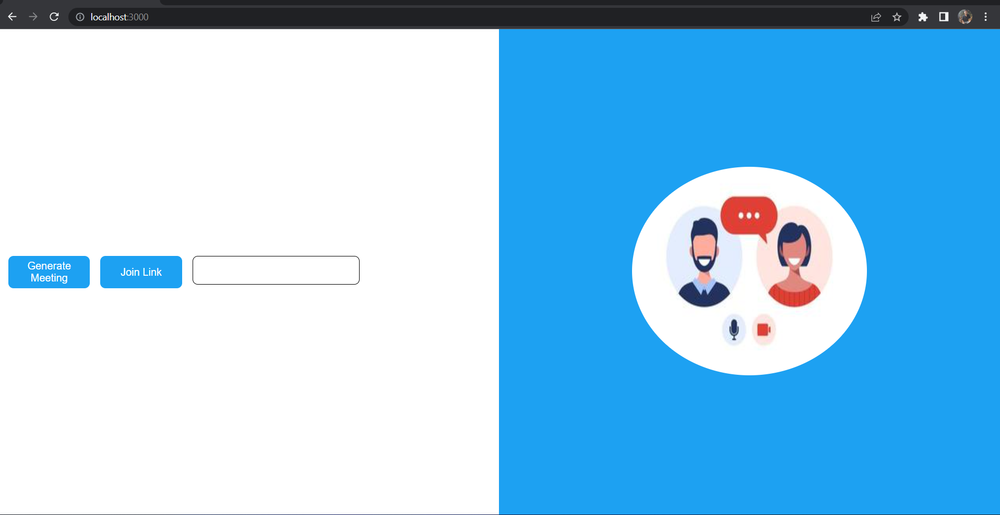
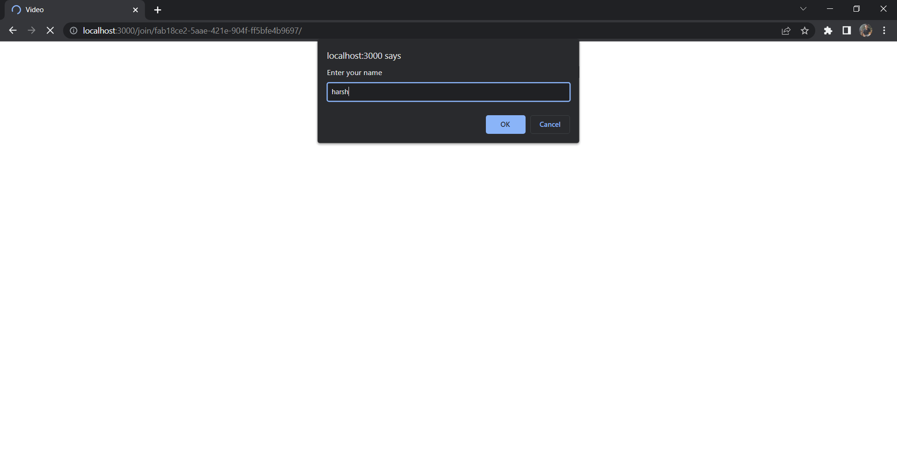
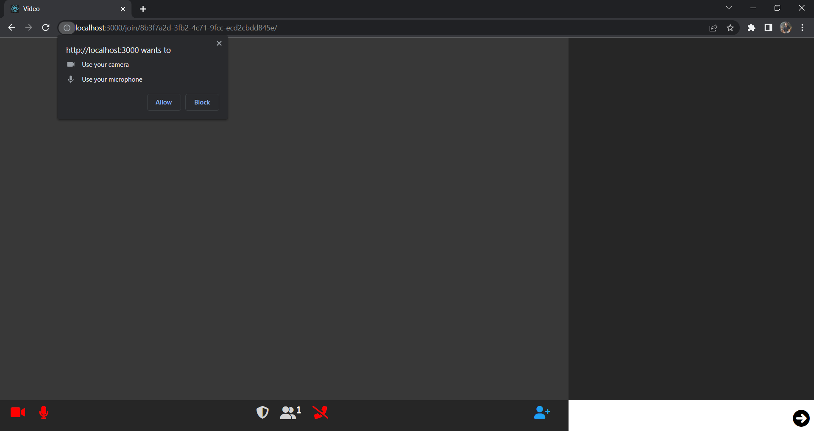
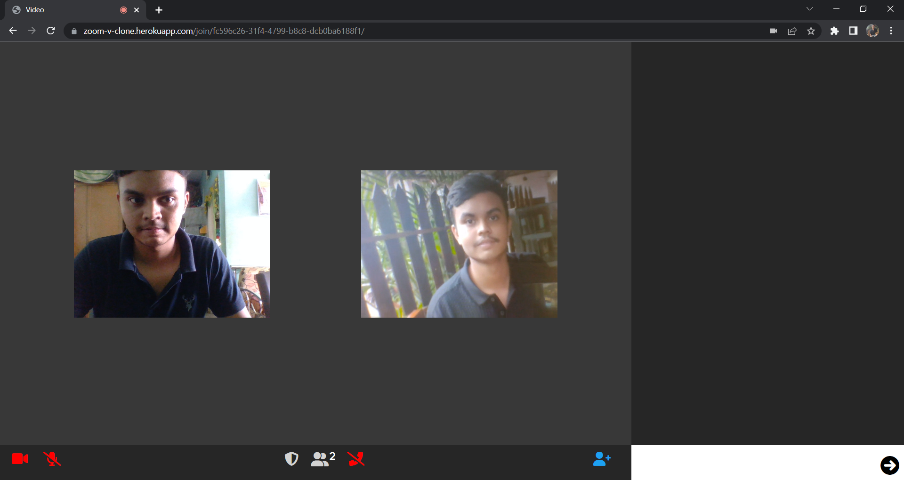

# Video Conferencing Web App

## Description

> A video conferencing web app built with technology like nodejs, expressjs, peerjs, and socket.io where you can video call your friends and chat with the help of technology like a socket.

## Project Interface and Features

1. Interface

   1. Home Page

   - You can directly generate meeting by clicking on genreate meeting button or you can join meeting by pasting link and clicking join meeting button
     - 
   - Then you will be ask to enter your name through prompt
     - 
   - Give permission of video and audio
     - 

   2. Video Conferencing Page
      - 

2. Features
   - you can setup your meeting through web through any device.
   - you can make video call and chat with your friends.
   - It is easy to use and responsive across any device.

## Installation

1. `git clone https://github.com/harsh123151/Zoom-clone.git`

2. `cd ./Zoom-clone`

3. Install node dependencies

   - `npm install`

4. `npm start`

5. The app is running on http://localhost:3000/

## Deployed Website

```
https://zoom-v-clone.herokuapp.com/
```
